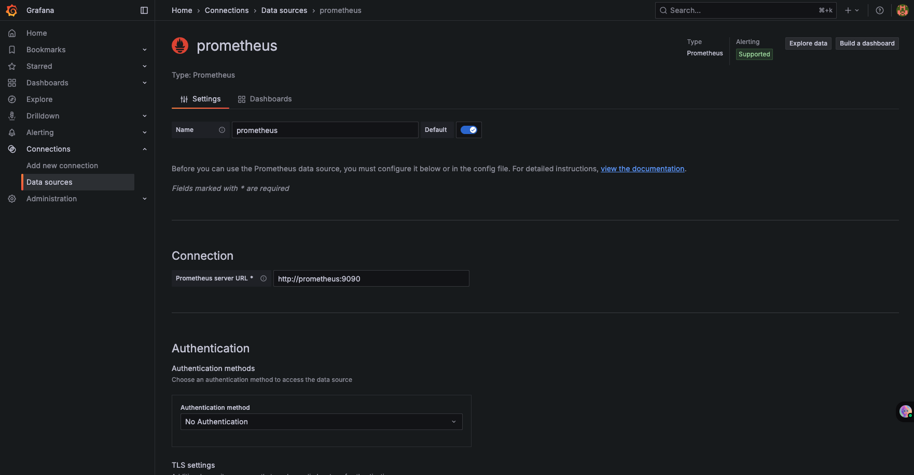
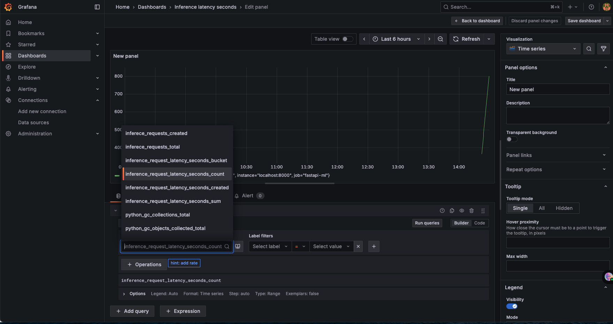
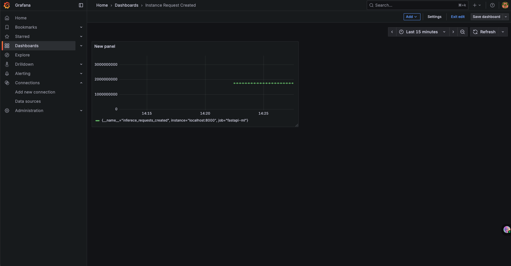
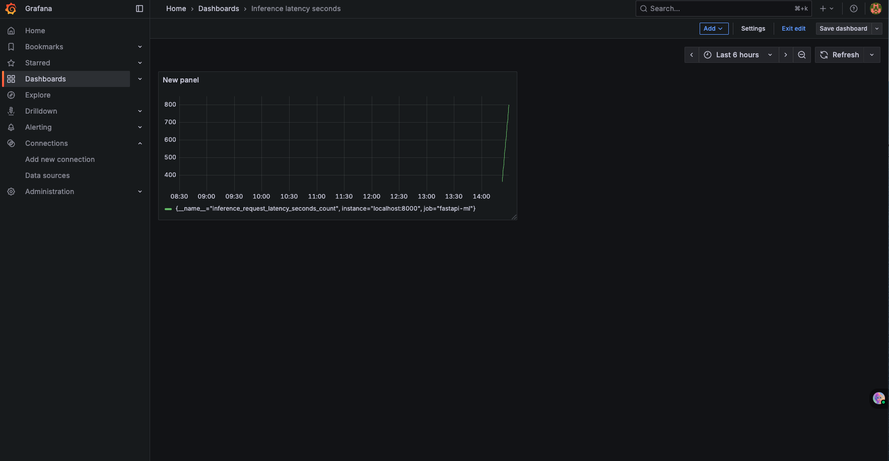

# Real time ML inference Pipeline with observability

This project demonstrates a real-time machine learning inference pipeline using Kafka, FastAPI, and Docker, with Prometheus & Grafana integration for observability.
It streams features from the Iris dataset, makes predictions using a logistic regression model, and provides full monitoring across the pipeline.

## Features

- Producer – streams Iris dataset features into Kafka.
- Consumer – consumes messages from Kafka and stores/logs predictions.
- Inference API – FastAPI service serving the ML model for real-time predictions.
- Observability – integrated Prometheus + Grafana dashboards for metrics and monitoring.
- Dockerized Setup – each component containerized with separate Dockerfiles and orchestrated via docker-compose.


## File Structure

```
Real-time-inference-pipeline-with-Observability/
├─ inference/
│  ├─ api.py
│  ├─ create_model.py
│  └─ Dockerfile
├─ producer/
│  ├─ producer.py
│  └─ Dockerfile
├─ consumer/
│  ├─ consumer.py
│  └─ Dockerfile
├─ requirements.txt
├─ prometheus.yml
└─ docker-compose.yml
```
## Getting Started

### Clone the Repository

```
git clone https://github.com/krishi0408/Real-Time-ML-Inference-Pipeline-with-Observability.git
cd Real-Time-ML-Inference-Pipeline-with-Observability
```

### Build and run with Docker Compose

```
docker-compose up --build
```

This will spin up:

- Zookeeper + Kafka
- Producer (Iris data streamer)
- Consumer (prediction consumer)
- Inference API (FastAPI on port 8000)
- Prometheus (metrics collection on port 9090)
- Grafana (dashboard visualization on port 3000)

## Accessing the Services

- Inference API (FastAPI docs) → http://localhost:8000/docs
- Prometheus → http://localhost:9090
- Grafana → http://localhost:3000
 (default creds: admin/admin)

## Grafana Setup

Once Grafana is running at [http://localhost:3000](http://localhost:3000):

1. Login with default credentials → `admin / admin`.
2. Go to **Configuration → Data Sources → Add Data Source**.
3. Select **Prometheus**.
4. In the URL field, enter: http://prometheus:9090

(This works inside Docker Compose since services share a network.)

5. Click **Save & Test** – Grafana will confirm the connection.
6. Import or create dashboards to start visualizing metrics.

> You can either create custom panels for API latency, Kafka throughput, and consumer lag, or import a prebuilt Prometheus dashboard JSON.



 ## Observability

- Metrics exposed:
  - API latency & request counts (FastAPI + Prometheus client)
  - Kafka message throughput
  - Consumer lag monitoring


- Grafana dashboards visualize:
  - Real-time inference request metrics
  - Kafka producer/consumer pipeline health
  - End-to-end ML pipeline performance

You can create Dashboard for seeing number of inference requests and for latency of inference requests in seconds.





## Tech Stack

- FastAPI – inference API
- Scikit-learn – logistic regression model (Iris dataset)
- Apache Kafka – message broker
- Prometheus + Grafana – monitoring & visualization
- Docker & Docker Compose – containerization & orchestration
